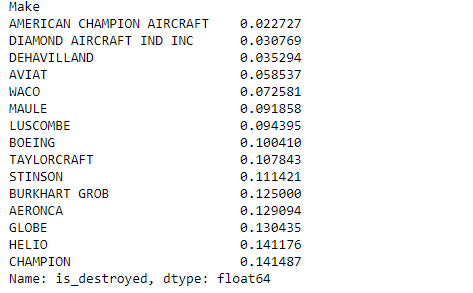
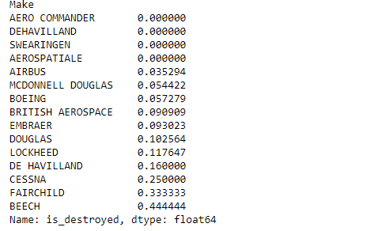
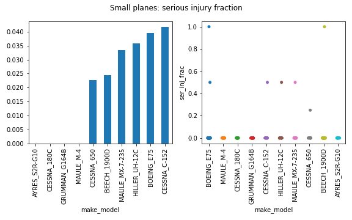
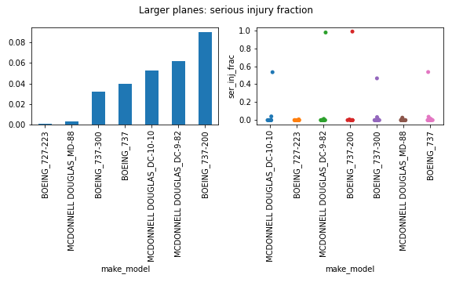
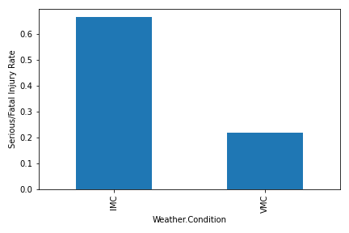
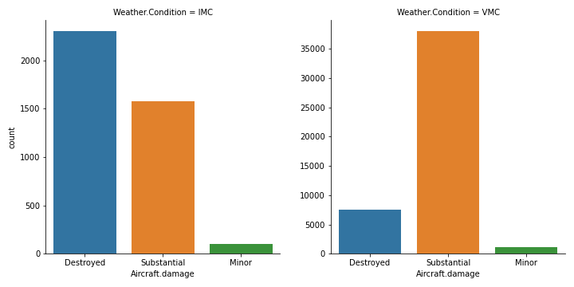
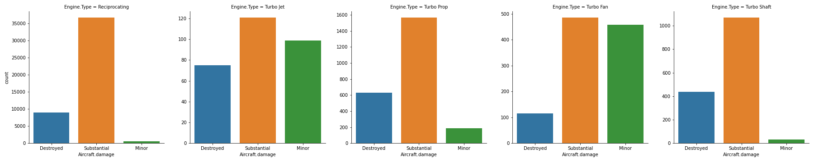

# Aviation Accident Analysis

## Overview 

The following is an analysis of injury rates and plane damage in the event of an airplane accident. As per the client's request, we have identified airplane makes and specific model types with the lowest historical (past 40 years) rates of fatal/serious injuries and complete airplane destruction in the event of an accident. The analysis was conducted in parallel for both small (< 12 passenger airplanes) and larger airplanes (> 12 passenger airplanes).

We have also analyzed the dependence of injury rates and likelihood of airplane destruction on two factors. The first was the meteorological weather condition and the second factor was airplane engine type.

## Analysis

### Constructed Metrics

The rate of serious/fatal injury was determined by computing the total number of fatally and seriously injured passengers and normmalizing by the total number of passengers. For each accident, this was calculated as follows:

    [n_(fatal) + n(serious)]/ N(passenger) 
    
    where N_passenger = n(fatal) + n(serious) + n(uninjured) + n(minor_injuries)

The other metric we tracked was whether a given accident resulted in destruction of the airplane involved. This was then used to compute aggregate statistics like the rate of airplane destruction (as opposed to other outcomes like serious or minor damage) in the event of an accident for a given Make. 

### Airplane Make Analysis

Below we show airplane makes for both small and larger aircraft that display the ten lowest rates of serious injuries and fatalities. 

 

We can see familiar passenger jet makes such as De Havilland, Airbus, and Boeing showing up in the list of larger aircraft makes posessing low serious injury rates. Aero commander, DeHavilland, and Swearingen have a zero serious injury / fatality rate recorded in the NTSB aviation database.

For smaller makes: Waco, Helio, and Boeing have the lowest average rates of serious injuries or fatalities. It is interesting to note that the average rate of serious injury tends to be higher across smaller makes than larger makes. This is possibly due to the fact that a single serious injury on a smaller airplane presents a larger serious injury fraction rate. It could also be due to pilot related effects in smaller vs larger aircraft (amateur vs. professional pilots, etc.), personal safety measures inside aircrafts of the two classes, and the general robustness of smaller aircraft vs larger aircraft to complete destruction. Further analysis and data collection would be required to separate some of these effects.

We also found the makes with the lowest rate of complete destruction for both smaller and larger aircraft sets.

Small aircraft destruction rates:

Large aircraft destruction rates:

A quick perusal of the makes show that many of the makes that have lowest rates of airplane destruction are also those who have the lowest rate of serious injuries / fatalities. This is sensible and it would be interesting to delve deeper in the dependence of one metric on the other.

### Airplane Model Analysis

For the safest small plane makes, the distributional strip plots reveal that events where there are a high fraction of serious/fatal injury fractions are in fact quite sparse. Most of these models in fact are dominated by accident events where there were zero serious injuries. 

One immediate take away from look at the average rates is that there are many Cessna models (in particular Cessna 180C, 650, C-152) clustered in the lowest injury risk models. 
 

For larger planes, many Boeing aircraft (in particular Boeing 737-200, 737-300, and Boeing 727-223) are amongst models exhibiting the lowest historical fraction of serious injuries / fatalities.
 

Again we can see for the strip plots that most accident events in these models result in no serious injuries although there are some events where we see catastrophic (near unity) fatality rates. These high serious injury fraction events are *rare* in these safest models.

### Factors

#### Weather Conditions

Weather condition under which an accident occurs falls into two classes: VMC and IMC which stand for Visual Meterological Conditions and Instrument Metereological Condition respectively. VMC corresponds to a situation where clearance between aircraft and terrain/other obstructions can be ascertained by pilots visually. Pilots can fly under visual flight rules in these conditions. IMC corresponds to low visibility scenarios where pilots must rely on instrumentation to make judgement on clearance/course headings.

Its pretty clear that the rate of serious passenger injuries and fatalities are much higher under IMC than under VMC in the event of an accident. 

 

We can also see that the share of airplanes completely destroyed (as opposed to having minor or serious levels of damage) during an accident is comparatively much higher under IMC than VMC conditions. 

 

Together this is perhaps not surprising: conditions under which pilots cannot see and were they must rely on instruments might result in crash accidents -- either with other airplanes, terrain, etc. It would be interesting to dig deeper and see how this further conditions across phase of flight (i.e. take off, mid-flight, landing, etc)

#### Engine Type

Turbo Fan engines (typically correponding to modern large passenger jets) seem to have both the lowest rate of total destruction in an accident as well as the lowest fraction 
of serious/fatally injured passengers. 

 

 

The other engine types all have similar rates of serious/fatally injuries although one can see that the reciprocating piston engine (the engine with the highest representation in the dataset and usually corresponding to smaller propeller aircraft) has a  fairly low rate of complete aircraft destruction in the event of an accident. 

