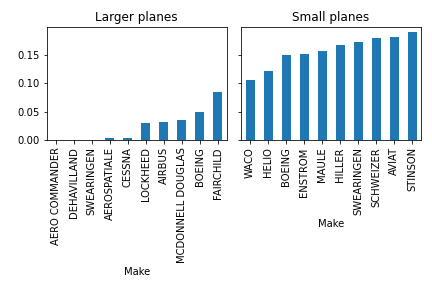

# Aviation Accident Analysis

## Overview 

The following is an analysis of injury rates and plane damage in the event of an airplane accident. As per the client's request, we have identified airplane makes and specific model types with the lowest historical (past 40 years) rates of fatal/serious injuries and complete airplane destruction in the event of an accident. The analysis was conducted in parallel for both small (< 12 passenger airplanes) and larger airplanes (> 12 passenger airplanes).

We have also analyzed the dependence of injury rates and likelihood of airplane destruction on two factors. The first was meteorological weather condition and the second factor was airplane engine type.

## Analysis

### Airplane Make Analysis

