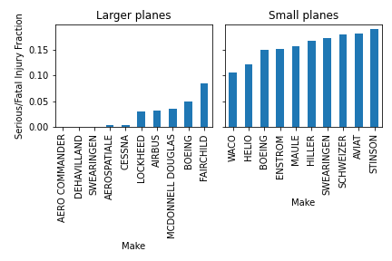

# Aviation Accident Analysis

## Overview 

The following is an analysis of injury rates and plane damage in the event of an airplane accident. As per the client's request, we have identified airplane makes and specific model types with the lowest historical (past 40 years) rates of fatal/serious injuries and complete airplane destruction in the event of an accident. The analysis was conducted in parallel for both small (< 12 passenger airplanes) and larger airplanes (> 12 passenger airplanes).

We have also analyzed the dependence of injury rates and likelihood of airplane destruction on two factors. The first was the meteorological weather condition and the second factor was airplane engine type.

## Analysis

### Constructed Metrics

The rate of serious/fatal injury was determined by computing the total number of fatally and seriously injured passengers and normmalizing by the total number of passengers. For each accident, this was calculated as follows:

    $$ \frac{n_{fatal} + n_{serious} }{N_{passenger}} $$ where $N_passenger = n_{fatal} + n_{serious} + n_{uninjured} + n_{minor_injuries}$

The other metric we tracked was whether a given accident resulted in destruction of the airplane involved. This was then used to compute aggregate statistics like the rate of airplane destruction (as opposed to other outcomes like serious or minor damage) in the event of an accident for a given Make. 

### Airplane Make Analysis

Below we show airplane makes for both small and larger aircraft that display the ten lowest rates of serious injuries and fatalities. 

We can see familiar passenger jet makes such as De Havilland, Airbus, and Boeing showing up in the list of larger aircraft makes posessing low serious injury rates. Aero commander, DeHavilland, and Swearingen have a zero serious injury / fatality rate recorded in the NTSB aviation database.

For smaller makes: Waco, Helio, and Boeing have the lowest average rates of serious injuries or fatalities. It is interesting to note that the average rate of serious injury tends to be higher across smaller makes than larger makes. This is possibly due to the fact that a single serious injury on a smaller airplane presents a larger serious injury fraction rate. It could also be due to pilot related effects in smaller vs larger aircraft (amateur vs. professional pilots, etc.), personal safety measures inside aircrafts of the two classes, and the general robustness of smaller aircraft vs larger aircraft to complete destruction. Further analysis and data collection would be required to separate these effects.

### Airplane Model Analysis

An analysis of airplane aircraft